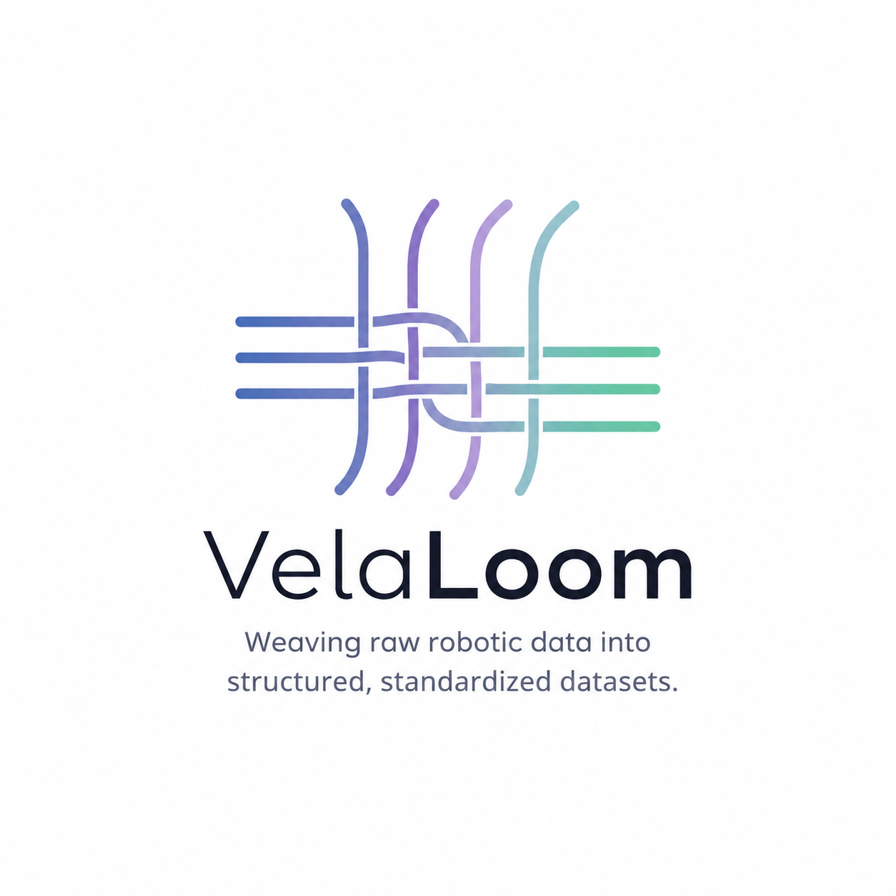

# VelaLoom

<p align="center">
  
</p>

一个机器人数据流水线工具集，将原始多模态数据编织、转换为结构化、标准化的数据集。

## Foxglove 中查看 Kuavo URDF

仓库中的 `urdf/biped_s300053.urdf` 是从原始 `kuavo_assets` 包导出的模型，网格路径仍然指向
`package://kuavo_assets/...`。当前仓库没有这个 ROS 包，因此直接在 Foxglove 导入该文件时，
URDF XML 可以打开，但 STL 网格无法解析，最终模型不会正常显示。

请在 Foxglove Desktop 的 3D 面板中导入专用文件：

```text
urdf_kuavo5/urdf/biped_s300053_foxglove.urdf
```

该版本将网格路径改为 `package://urdf_kuavo5/meshes/...`，与本仓库目录一致。将 3D 面板的
Fixed frame 设为 `base_link`（或 bag 中存在的 `odom`），URDF Control mode 选择 `Transforms`。
如果 Foxglove 仍提示找不到资源，可在 Settings → ROS package paths 中加入仓库根目录：

```bash
export ROS_PACKAGE_PATH=/Volumes/yuto2/yuto/codehub/VelaLoom:$ROS_PACKAGE_PATH
```

bag 中的主体 TF（`base_link`、腿、腰、手臂和头部）与该 URDF 的 link 名称一致。相机图像原始
帧名是 `cam_*_color_optical_frame`，若还需要在 3D 面板中把相机图像叠加到机器人坐标系，先用
根目录 `scripts/modify_rosbag_camera_frames.py` 生成带相机连接 TF 的新 bag；该脚本不会修改输入 bag。

例如：

```bash
python3 scripts/modify_rosbag_camera_frames.py \
  rosbag/<input>.bag rosbag/<input>-foxglove.bag
```

该转换同时统一彩色图像和 `camera_info` 的 `frame_id`，并补充左右手相机、头部相机到机器人
TF 树的静态连接。
